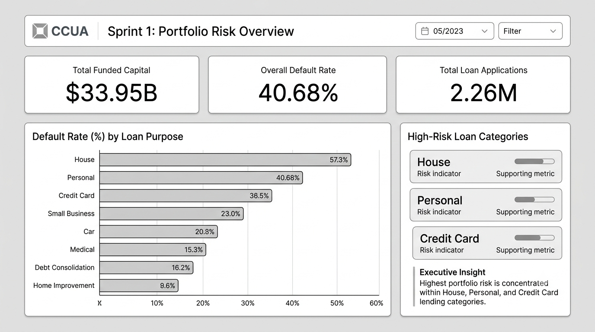
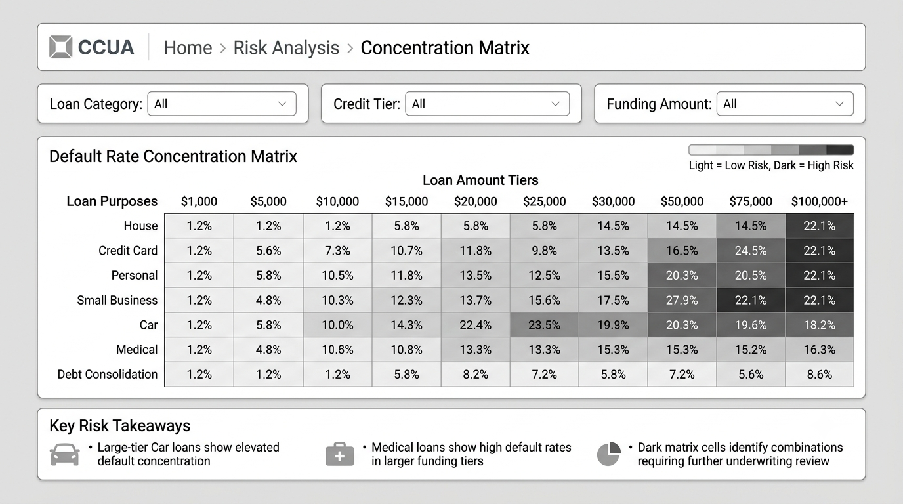
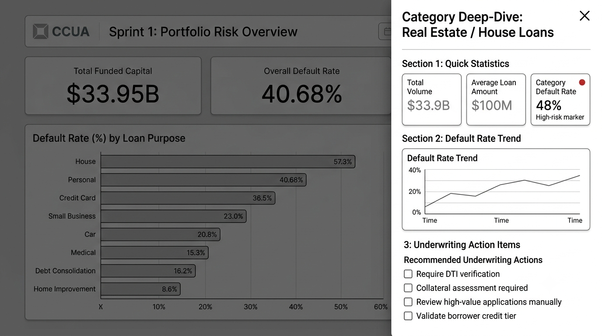
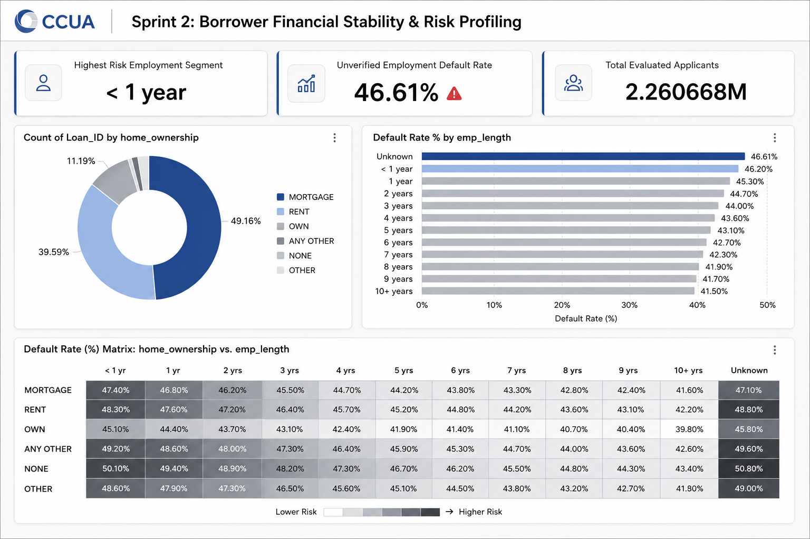
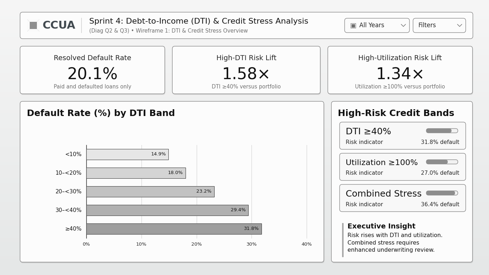
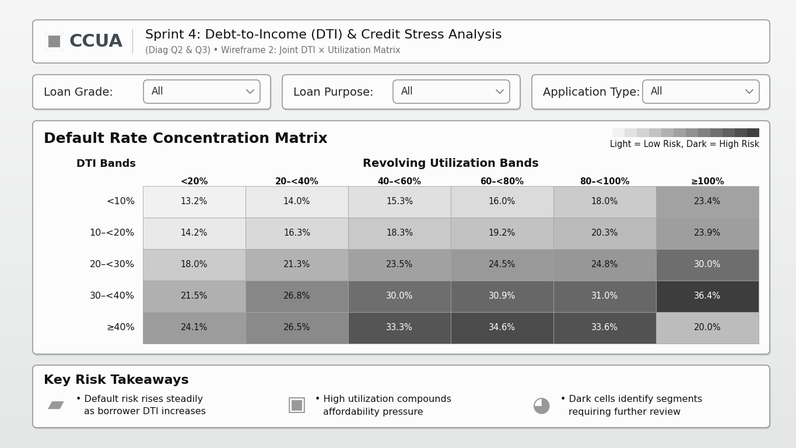
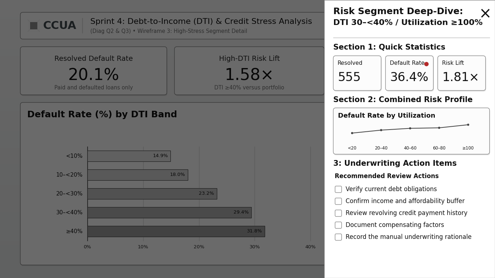
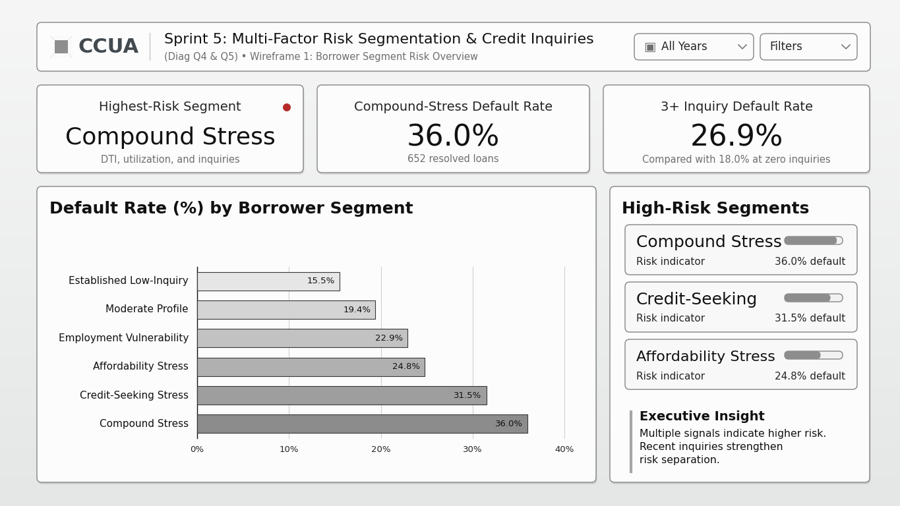
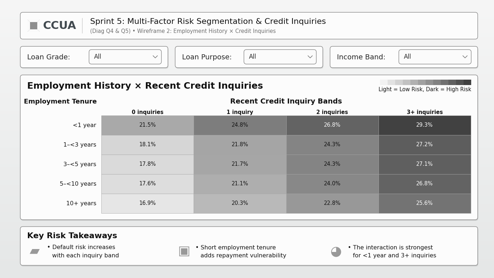
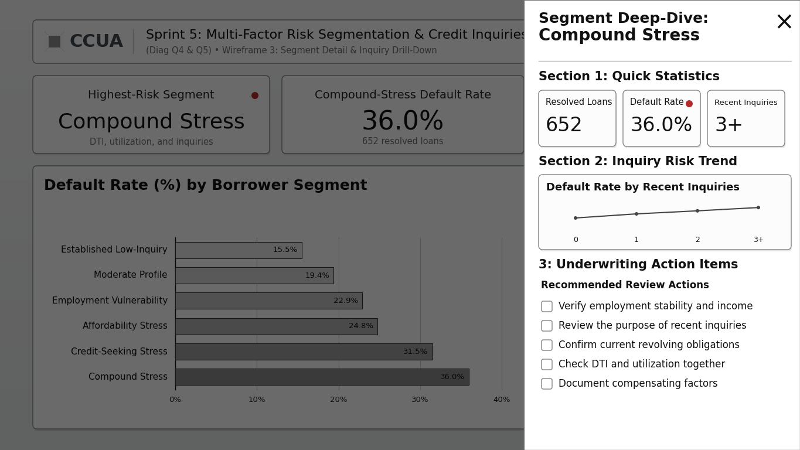

# Capstone_Group_4
# CCUA Credit Risk & Default Portfolio Analytics


## 📌 Project Overview
This repository contains the end-to-end data pipeline, analytical models, and dashboard implementations for the **Canadian Credit Union Association (CCUA)** Credit Risk Analysis Project. 

**Sprint 1 Focus:** Establishing baseline portfolio health, quantifying macro default rates, and isolating high-risk lending categories across principal deployment tiers.

---

## 🎨 Sprint 1 Design & Wireframes

The Sprint 1 user experience and visual layout were designed using a multi-wireframe approach to map executive user flows from macro overview down to category deep-dives.

### Wireframe 1: Executive High-Level Overview
> **Objective:** Present top-level portfolio KPIs and immediate default frequency by loan purpose.



* **Key Elements:** Top KPI summary row (Funded Capital, Default Rate, Total Applications), horizontal default rate distribution, and high-risk category callouts.

---

### Wireframe 2: Risk Concentration Matrix (Drill-Down View)
> **Objective:** Evaluate multi-dimensional risk cross-tabulating loan purpose against principal funding tiers.



* **Key Elements:** Interactive heatmap grid, cross-category filter slicers, and concentration severity highlighting.

---

### Wireframe 3: Category Detail Drawer (Interactive Flow)
> **Objective:** Provide underwriting teams with granular category-level metrics and action items.



* **Key Elements:** Category-specific trends, collateral requirements checklist, and risk mitigation action panels.

---

## 🐍 Data Cleaning & Transformation Pipeline (Python)

Before importing data into the SQLite database (`CCUA_Analytics.db`) and Power BI, initial data cleaning, binary status encoding, and schema transformations were executed in Python.

### Transformation Script

```python
import pandas as pd
import sqlite3

# Load raw dataset
df = pd.read_csv("raw_loan_data.csv")

# Clean & encode binary loan status (1 = Default, 0 = Paid)
df['loan_status_encoded'] = df['loan_status'].apply(
    lambda x: 1 if x in ['Default', 'Charged Off'] else 0
)

# Filter valid records & drop empty critical keys
df_clean = df.dropna(subset=['Loan_ID', 'loan_amnt', 'purpose'])

# Export cleaned data frame into SQLite database
conn = sqlite3.connect("CCUA_Analytics.db")
df_clean.to_sql("Dim_Loan_Account", conn, if_exists="replace", index=False)
conn.close()

print("Data transformation complete. Database populated.")
```

---

# Sprint 2: Borrower Financial Stability & Risk Profiling

## 🎨 Sprint 2 Design & Wireframe

Sprint 2 shifts the dashboard focus from portfolio-level credit risk to **Borrower Financial Stability & Risk Profiling**.

The wireframe was designed to explore how borrower employment tenure (`emp_length`) and homeownership status (`home_ownership`) can be used to identify patterns associated with loan default risk.

### Wireframe: Borrower Financial Stability & Risk Profiling

> **Objective:** Provide an executive-level view of borrower stability by examining employment tenure, homeownership distribution, and the interaction between these factors and loan default rates.



- **Key Elements:**
  - **Top KPI Summary Row:** Highlights the Highest Risk Employment Segment (`< 1 year`), Unverified Employment Default Rate (`46.61%`), and Total Evaluated Applicants (`2.260668M`).
  - **Homeownership Distribution:** Donut chart displaying the distribution of applicants across `MORTGAGE`, `RENT`, `OWN`, and minority homeownership categories.
  - **Employment Tenure Risk Profile:** Horizontal bar chart comparing default rates across employment-length categories, from `Unknown` and `< 1 year` through `10+ years`.
  - **Borrower Risk Matrix:** Heatmap matrix cross-tabulating `home_ownership` against `emp_length`, with conditional shading used to identify combinations associated with higher default rates.

---

# Sprint 4: Debt-to-Income (DTI) & Credit Stress Analysis

## 🎨 Sprint 4 Design & Wireframes

Sprint 4 focuses on **Debt-to-Income (DTI) & Credit Stress Analysis** and addresses Diagnostic Questions 2 and 3. The wireframes were designed to examine how borrower DTI and revolving credit utilization relate to resolved loan default and repayment performance.

### Wireframe 1: DTI & Credit Stress Overview
> **Objective:** Summarize portfolio-level DTI and utilization stress through executive KPIs, banded trends, and review triggers.



- **Key Elements:**
  - **Top KPI Summary Row:** Displays the resolved default rate, high-DTI risk lift, and high-utilization risk lift.
  - **DTI Risk Profile:** Horizontal bar chart comparing default rates across DTI bands from `<10%` through `≥40%`.
  - **High-Risk Credit Bands:** Highlights elevated-risk DTI, utilization, and combined-stress categories.
  - **Executive Insight:** Summarizes the relationship between increasing credit stress and default risk.

---

### Wireframe 2: Joint DTI × Utilization Matrix
> **Objective:** Cross-tabulate DTI and revolving-utilization bands to reveal where combined credit stress is concentrated.



- **Key Elements:**
  - **DTI × Utilization Heatmap:** Cross-tabulates DTI bands against revolving-utilization bands.
  - **Conditional Shading:** Uses darker cells to identify combinations with higher resolved default rates.
  - **Risk Takeaways:** Explains how high utilization can compound borrower affordability pressure.
  - **Review Support:** Helps underwriting teams identify segments requiring further investigation.

---

### Wireframe 3: High-Stress Segment Detail
> **Objective:** Give underwriting staff a drill-down view of a selected high-stress borrower segment.



- **Key Elements:**
  - **Quick Statistics:** Displays resolved-loan volume, segment default rate, and risk lift.
  - **Combined Risk Profile:** Shows the change in default rate across utilization bands for the selected DTI segment.
  - **Underwriting Checklist:** Provides review prompts for obligations, income, affordability, payment history, and compensating factors.
  - **Interactive Drawer:** Demonstrates how a user can move from the summary dashboard into a selected high-stress segment.

---

## 🐍 Sprint 4 Python Analysis: Debt-to-Income (DTI) & Credit Stress

This analysis addresses:

* **Diagnostic Question 2:** Why do applicants with high debt-to-income ratios show higher financial risk?
* **Diagnostic Question 3:** How does revolving credit utilization influence repayment performance?

The script keeps only resolved outcomes—paid or defaulted loans—when calculating historical default rates. Current, late, and grace-period loans are not incorrectly counted as paid loans.

```python
import numpy as np
import pandas as pd

DATA_FILE = "cleaned_loan_data.csv"

PAID_STATUSES = {
    "Fully Paid",
    "Does not meet the credit policy. Status:Fully Paid",
}
DEFAULT_STATUSES = {
    "Charged Off",
    "Default",
    "Does not meet the credit policy. Status:Charged Off",
}

# Load only the columns required for the Sprint 4 diagnostic questions.
loans = pd.read_csv(
    DATA_FILE,
    usecols=["loan_status", "dti", "revol_util"],
)

loans["repayment_outcome"] = np.select(
    [
        loans["loan_status"].isin(DEFAULT_STATUSES),
        loans["loan_status"].isin(PAID_STATUSES),
    ],
    ["Default", "Paid"],
    default="Other",
)

# Historical default analysis uses resolved outcomes only.
resolved = loans.loc[
    loans["repayment_outcome"].isin(["Default", "Paid"])
].copy()
resolved["default_flag"] = resolved["repayment_outcome"].eq("Default").astype(int)
resolved["dti"] = pd.to_numeric(resolved["dti"], errors="coerce")
resolved["revol_util"] = pd.to_numeric(resolved["revol_util"], errors="coerce")

resolved["dti_band"] = pd.cut(
    resolved["dti"],
    bins=[-np.inf, 10, 20, 30, 40, np.inf],
    labels=["<10%", "10–<20%", "20–<30%", "30–<40%", "40%+"],
    right=False,
)
resolved["utilization_band"] = pd.cut(
    resolved["revol_util"],
    bins=[-np.inf, 20, 40, 60, 80, 100, np.inf],
    labels=["<20%", "20–<40%", "40–<60%", "60–<80%", "80–<100%", "100%+"],
    right=False,
)

def summarize_risk(data, group_column):
    summary = (
        data.dropna(subset=[group_column])
        .groupby(group_column, observed=True)["default_flag"]
        .agg(loans="size", defaults="sum", default_rate="mean")
        .reset_index()
    )
    summary["default_rate_pct"] = summary["default_rate"] * 100
    return summary.drop(columns="default_rate")

dti_summary = summarize_risk(resolved, "dti_band")
utilization_summary = summarize_risk(resolved, "utilization_band")

# Combined DTI and utilization view used by the Sprint 4 risk matrix.
joint_summary = (
    resolved.dropna(subset=["dti_band", "utilization_band"])
    .groupby(["dti_band", "utilization_band"], observed=True)["default_flag"]
    .agg(loans="size", defaults="sum", default_rate="mean")
    .reset_index()
)
joint_summary["default_rate_pct"] = joint_summary["default_rate"] * 100
joint_summary = joint_summary.drop(columns="default_rate")

dti_summary.to_csv("sprint4_dti_summary.csv", index=False)
utilization_summary.to_csv("sprint4_utilization_summary.csv", index=False)
joint_summary.to_csv("sprint4_joint_risk_matrix.csv", index=False)

print(dti_summary)
print(utilization_summary)
print(joint_summary)
```

---

# Sprint 5: Multi-Factor Risk Segmentation & Credit Inquiries

## 🎨 Sprint 5 Design & Wireframes

Sprint 5 focuses on **Multi-Factor Risk Segmentation & Credit Inquiries** and addresses Diagnostic Questions 4 and 5. The wireframes were designed to compare transparent borrower-risk segments and examine how employment history and recent credit inquiries relate to resolved loan outcomes.

### Wireframe 1: Borrower Segment Risk Overview
> **Objective:** Compare default risk across transparent, multi-factor borrower segments.



- **Key Elements:**
  - **Top KPI Summary Row:** Highlights the highest-risk segment, compound-stress default rate, and the default rate for borrowers with three or more inquiries.
  - **Borrower Segment Comparison:** Horizontal bar chart comparing resolved default rates across six explainable borrower segments.
  - **High-Risk Segment Panel:** Highlights Compound Stress, Credit-Seeking Stress, and Affordability Stress.
  - **Executive Insight:** Explains how multiple simultaneous stress signals identify higher-risk borrowers.

---

### Wireframe 2: Employment History × Credit Inquiries
> **Objective:** Cross-tabulate employment tenure and recent credit inquiries to reveal interaction patterns in repayment outcomes.



- **Key Elements:**
  - **Employment × Inquiry Matrix:** Cross-tabulates employment-tenure bands against recent credit-inquiry bands.
  - **Conditional Shading:** Uses darker cells to identify combinations with higher resolved default rates.
  - **Portfolio Filters:** Allows analysis by loan grade, purpose, and income band.
  - **Risk Takeaways:** Summarizes how short employment tenure and repeated inquiries can interact.

---

### Wireframe 3: Segment Detail & Inquiry Drill-Down
> **Objective:** Provide an interactive drill-down for a selected borrower segment.



- **Key Elements:**
  - **Quick Statistics:** Displays the selected segment's loan count, resolved default rate, and inquiry level.
  - **Inquiry Risk Trend:** Shows how resolved default rates change as recent inquiries increase.
  - **Underwriting Checklist:** Prompts the reviewer to verify employment, inquiry purpose, revolving obligations, DTI, and utilization.
  - **Interactive Drawer:** Demonstrates how the user can drill into a selected borrower segment without leaving the main dashboard.

---

## 🐍 Sprint 5 Python Analysis: Multi-Factor Risk Segmentation & Credit Inquiries

This analysis addresses:

* **Diagnostic Question 4:** Why are certain borrower segments more likely to default than others?
* **Diagnostic Question 5:** What relationships exist between employment history, credit inquiries, and loan repayment outcomes?

The segment rules are mutually exclusive and listed in priority order so that every resolved loan receives one clear, explainable borrower-segment label.

```python
import numpy as np
import pandas as pd

DATA_FILE = "cleaned_loan_data.csv"

PAID_STATUSES = {
    "Fully Paid",
    "Does not meet the credit policy. Status:Fully Paid",
}
DEFAULT_STATUSES = {
    "Charged Off",
    "Default",
    "Does not meet the credit policy. Status:Charged Off",
}

# Load only the fields needed for segmentation and inquiry analysis.
loans = pd.read_csv(
    DATA_FILE,
    usecols=[
        "loan_status",
        "emp_length_years",
        "inq_last_6mths",
        "annual_inc",
        "home_ownership",
        "dti",
        "revol_util",
        "grade",
    ],
)

loans["repayment_outcome"] = np.select(
    [
        loans["loan_status"].isin(DEFAULT_STATUSES),
        loans["loan_status"].isin(PAID_STATUSES),
    ],
    ["Default", "Paid"],
    default="Other",
)

resolved = loans.loc[
    loans["repayment_outcome"].isin(["Default", "Paid"])
].copy()
resolved["default_flag"] = resolved["repayment_outcome"].eq("Default").astype(int)

numeric_columns = [
    "emp_length_years",
    "inq_last_6mths",
    "annual_inc",
    "dti",
    "revol_util",
]
resolved[numeric_columns] = resolved[numeric_columns].apply(
    pd.to_numeric,
    errors="coerce",
)

# Complete cases are used so missing values are not silently treated as low risk.
analysis = resolved.dropna(
    subset=["emp_length_years", "inq_last_6mths", "dti", "revol_util"]
).copy()

analysis["employment_band"] = pd.cut(
    analysis["emp_length_years"],
    bins=[-np.inf, 1, 3, 5, 10, np.inf],
    labels=["<1 year", "1–<3 years", "3–<5 years", "5–<10 years", "10+ years"],
    right=False,
)
analysis["inquiry_band"] = pd.cut(
    analysis["inq_last_6mths"],
    bins=[-np.inf, 1, 2, 3, np.inf],
    labels=["0", "1", "2", "3+"],
    right=False,
)

# Mutually exclusive, explainable borrower segments.
conditions = [
    (analysis["dti"] >= 30)
    & (analysis["revol_util"] >= 80)
    & (analysis["inq_last_6mths"] >= 3),
    (analysis["inq_last_6mths"] >= 3)
    & ((analysis["dti"] >= 30) | (analysis["revol_util"] >= 80)),
    (analysis["dti"] >= 30) | (analysis["revol_util"] >= 80),
    (analysis["emp_length_years"] < 3)
    & (analysis["inq_last_6mths"] >= 1),
    (analysis["emp_length_years"] >= 5)
    & (analysis["inq_last_6mths"] == 0)
    & (analysis["dti"] < 30)
    & (analysis["revol_util"] < 80),
]
segment_names = [
    "Compound Stress",
    "Credit-Seeking Stress",
    "Affordability Stress",
    "Employment Vulnerability",
    "Established Low-Inquiry",
]
analysis["borrower_segment"] = np.select(
    conditions,
    segment_names,
    default="Moderate Profile",
)

segment_summary = (
    analysis.groupby("borrower_segment")
    .agg(
        loans=("default_flag", "size"),
        defaults=("default_flag", "sum"),
        default_rate=("default_flag", "mean"),
        median_dti=("dti", "median"),
        median_utilization=("revol_util", "median"),
        median_inquiries=("inq_last_6mths", "median"),
        median_employment_years=("emp_length_years", "median"),
        median_annual_income=("annual_inc", "median"),
    )
    .reset_index()
)
segment_summary["default_rate_pct"] = segment_summary["default_rate"] * 100
segment_summary = segment_summary.drop(columns="default_rate")

# Employment tenure × recent inquiry matrix used by Wireframe 2.
employment_inquiry_summary = (
    analysis.groupby(["employment_band", "inquiry_band"], observed=True)[
        "default_flag"
    ]
    .agg(loans="size", defaults="sum", default_rate="mean")
    .reset_index()
)
employment_inquiry_summary["default_rate_pct"] = (
    employment_inquiry_summary["default_rate"] * 100
)
employment_inquiry_summary = employment_inquiry_summary.drop(columns="default_rate")

segment_summary.to_csv("sprint5_borrower_segment_summary.csv", index=False)
employment_inquiry_summary.to_csv(
    "sprint5_employment_inquiry_matrix.csv",
    index=False,
)

print(segment_summary.sort_values("default_rate_pct", ascending=False))
print(employment_inquiry_summary)
```

---
